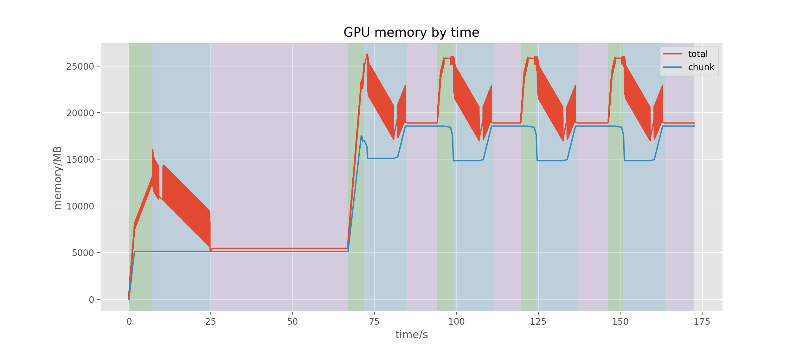
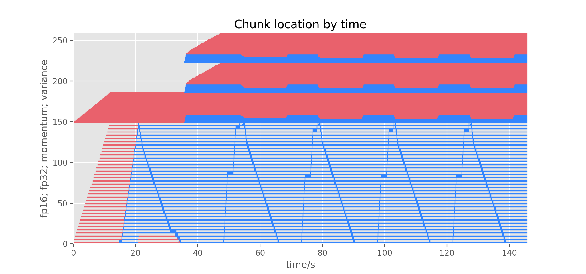

## How to use PatrickStar

Here are some instructions for making better use of PatrickStar.

### Create model with `intialize_engine`

To create model and optimizer of PatrickStar, you will use the `initialize_engine` API:

```python
from patrickstar.runtime import initialize_engine

...

model, optimizer = initialize_engine(
    model_func=model_func,
    local_rank=local_rank,
    config=config
)
```

This function will return a `PatrickStarEngine` and a `FP16Adam`. You could take `PatrickStarEngine` as a wrapped model (it is also a derived class of `nn.Module`). The memory management of PatrickStar relies on it. `FP16Adam` is a float16 version of Adam (also supports AdamW) as the name indicates. It is capable of doing both the CPU and the GPU param update fast.

- `model_func`

The `model_func` is a function with no argument that will create the `nn.Module` model. Below is a `model_func` example for [HuggingFace Transformers](https://github.com/huggingface/transformers):

```python
from transformers import BertForSequenceClassification

def model_func():
    return BertForSequenceClassification.from_pretrained("bert-base-uncased")
```

Note that **all the intializaiton of the `nn.Module`s need to happen in `model_func`**, because PatrickStar needs to detect all the `__init__` of `nn.Modules` in `model_func` to insert the chunk based memory management. Therefore, the following `model_func` will cause error:

```python
# Bad model_func
model = BertForSequenceClassification.from_pretrained("bert-base-uncased")

def model_func():
    return model
```

- `local_rank`

`local_rank` is the rank of the process in the local machine (contrary to global rank, which is the rank in the whole distributed group). You could get the `local_rank` from `args.local_rank` when using `torch.distributed.launch` or `torch.distributed.run` to start your distributed training.

- `config`

`config` is the configuration of the training. It includes the config for optimizer, loss scaler and some PatrickStar specific settings. The Configuration section below will give you a detailed introduction.

- `client`

There is a fourth argument of `intialize_engine` - `client`. This is only used when it is really hard to extract the model into a `model_func` and you need to create the `PatrickStarEngine` manually.

### Train

When you have initialized the model, the training process is basically the same as native pytorch:

```python
for data in dataloader:
    optimizer.zero_grad()

    loss = model(data)
    model.backward(loss)
    optimizer.step()
```

The only difference is that you need to use `model.backward(loss)` instead of `loss.backward()`.

### Save and Load

PatrickStar supports saving and loading model params and optimizer state using the same API of pytorch. You could use:

```python
torch.save(model.state_dict(), "model.pt")
torch.save(optimizer.state_dict(), "optimizer.pt")
```

to save the model and the optimizer and use:

```python
model_state_dict = torch.load("model.pt")
opt_state_dict = torch.load("optimizer.pt")
model.load_state_dict(model_state_dict)
optimizer.load_state_dict(opt_state_dict)
```

to load the training state.

Note that when using distributed training with PatrickStar, each process will hold only 1/N (N is the number of processes) of the model. Therefore we recommend to attach the rank number to the checkpoint filename:

```python
torch.save(model.state_dict(), f"model-{rank}.pt")
torch.save(optimizer.state_dict(), f"optimizer-{rank}.pt")
```

You make hope to merge the checkpoints for inference. As the checkpoints are only `OrderedDict`s, you could:

```python
# Combine 2 checkpoints and load into the whole model.
state_dict = torch.load("checkpoint-0.pt")
state_dict1 = torch.load("checkpoint-1.pt")
state_dict.update(state_dict1)
model.load_state_dict(state_dict)
```

We also provide a tool for merging checkpoints, please check the Merge Checkpoints section below.

### Profiler

You could profile the memory usage or the location of chunks with the profiler module in PatrickStar. Here is an example of profiler:

```python
from patrickstar.profiler import profiler

profiler.start()
model, optimizer = initialize_engine(
    model_func=model_func, local_rank=rank, config=config
)

...

for data in dataloader:
    ...

profiler.end()
if rank == 0:
    profiler.save("profile.pkl")
```

You could visualize the saved `profile.pkl` with the profiler visualizer tool we provide. For detail, check the Profile Visualizer section below.

### Configuration

The configuration is a python dictionary with the same format as [DeepSpeed config](https://www.deepspeed.ai/docs/config-json/), the following are most configs and their default values:

```python
config = {
    # configs for optimizer
    "optimizer": {
        # type can only be "Adam" or "AdamW" for now
        "type": "Adam",
        "params": {
            "lr": lr,
            "betas": betas,
            "eps": eps,
            "weight_decay": weight_decay,
            # If set to False, all the adam operations will be on CPU.
            "use_hybrid_adam": True,
        },
    },
    # If there is no "fp16" field in the config,
    # then the model will be trained without loss scaler.
    # Note that there are no loss scaler on default.
    "fp16": {
        # Always need to be True
        "enabled": True,
        # If set to 0, use dynamic loss scaler,
        # otherwise use static loss scaler with the value as loss scale
        # Note that static loss scale will not check if the gradient overflows.
        "loss_scale": 0,
        # The initial loss scale of dynamic loss scaler will be
        # 2 ** initial_scale_power
        "initial_scale_power": 16,
        "loss_scale_window": 1000,
        "hysteresis": 2,
        "min_loss_scale": 1,
    },
    # The default chunk size, recommend values are 32M or 64M.
    # Note that this is the number of elements in a chunk instead
    # of the number of bytes.
    "chunk_size": 64 * 1024 * 1024,
    # In distributed training, PatrickStar will release the remote chunks
    # (the memory that is not managed by the current process) if
    # "release_after_init" is False. This will reduce the total CPU memory
    # consumption of the intiailization. However, release during init may
    # be conflict with the weight loading or weight initialization of
    # some library, e.g. `from_pretrained` in HuggingFace. In those cases,
    # set the "release_after_init" to True.
    "release_after_init": False,
}
```

### Tools

#### Profile Visualizer

The profiler visualizer (`tools/visualizer`) could visualize the saved profile data.

The following command could visualize the GPU memory info:

```bash
python tools/profile_visualizer.py profile.pkl --fig_type=memory --memory_type=GPU
```



The red curve is the total GPU memory used, blue curve is the memory manged by chunk. The green, blue and purple background represent forward, backward, adam stage respectively.

We could also visualize the location info of chunks:

```bash
python tools/profile_visualizer.py profile.pkl --fig_type=access
```



The red part means the chunk is on GPU, blue part means chunk is on GPU. The four section from bottm to top are the chunks of type FP16_PARAM, FP32_PARAM, VARIANCE and MOMENTUM.

#### Merge Checkpoints

PatrickStar also provides a tool for merging the distributed checkpoints with `tools/merge_checkpoint.py`.

An example command is:

```bash
python tools/merge_checkpoint.py --pattern=checkpoint-*.pt --num=4
```

The script will replace the `*` with 0, 1, 2, 3 and merge the four checkpoints (`checkpoint-0.pt`, `checkpoint-1.pt`, `checkpoint-2.pt`, `checkpoint-3.pt`) into `checkpoint-merged.pt`.
