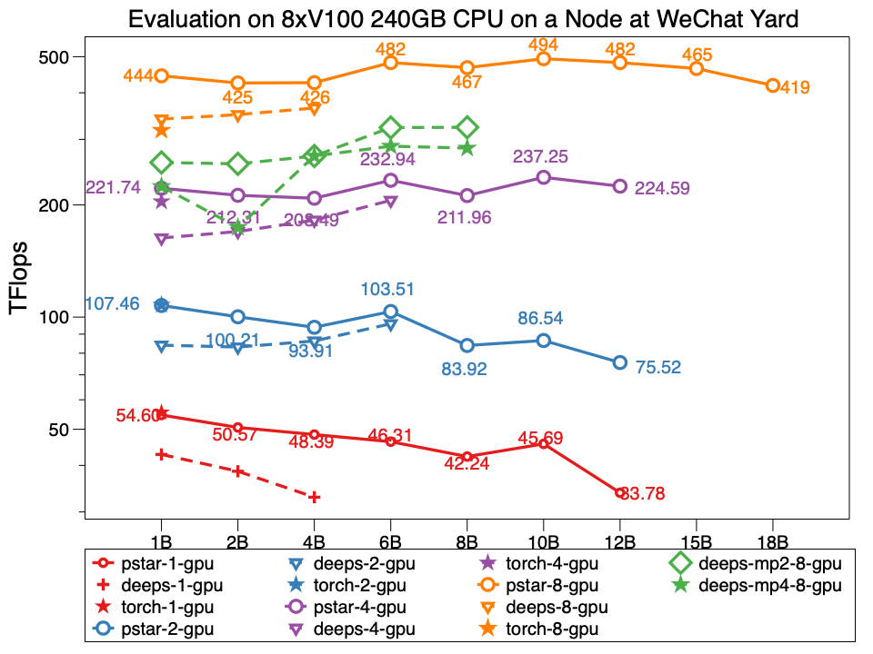

### PatrickStar(派大星): Parallel Training of Large Language Models via a Chunk-based Memory Management

### 认识派大星
预训练模型（Pre-Trained Model，PTM）正成为NLP研究的主流技术路线。它在大量文本上Pretrain具有通用语言特征的模型，然后使用特定于任务的数据集对模型进行Finetuning。然而，PTM训练往往需要巨大的计算资源，仍然是AI社区小部分人的游戏。现在，**派大星让PTM可以普惠到每一个算法工程师**。

使用预训练模型时，OOM是算法工程师的噩梦。为此，必须使用更多的GPU卡来存储模型参数。派大星解决了这个问题，让你使用少量GPU的普通的硬件尽可能运行超大模型。
派大星采用异构训练方式（它也被DeepSpeed Zero Stage3采用），利用CPU内存和GPU显存存储训练过程的模型数据。
我们观察到可用于模型数据的GPU内存有规律地变化，以类似潮汐的模式，迭代地减少和增加。
然而，现有的异构训练工作并没有利用这种模式。相反，它们在CPU和GPU之间静态划分模型数据，从而导致内存浪费和内存滥用。相比之下，PatrickStar以Chunk的形式管理模型数据，这些数据动态分布在异构内存空间中，因此可以获得更高的内存利用效率和计算效率。
实验结果表明，PatrickStar在8xV100和240GB CPU 内存节点上训练了一个 120亿(12 Billion)参数的GPT-2模型，比SOTA工作大2倍，并且在相同的模型大小上也更高效。



### 使用方法
派大星核心逻辑使用PyTorch编写，具有很好的可移植性，如下Linux命令展示了派大星的用法
```
pip install .
cd examples && run run_bert.sh
```

派大星正在被集成到[TencentPretrain](https://git.woa.com/TencentNLP/TencentPretrain)之中，参考我们的[MR](https://git.woa.com/TencentNLP/TencentPretrain/merge_requests/61)。

### 引用派大星
```
@article{fang2021patrickstar,
  title={PatrickStar: Parallel Training of Pre-trained Models via a Chunk-based Memory Management},
  author={Fang, Jiarui and Yu, Yang and Li, Shenggui and You, Yang and Zhou, Jie},
  journal={arXiv preprint arXiv:2108.05818},
  year={2021}
}
```

### 联系我们
企业微信
jiaruifang, zilinzhu, josephyu
