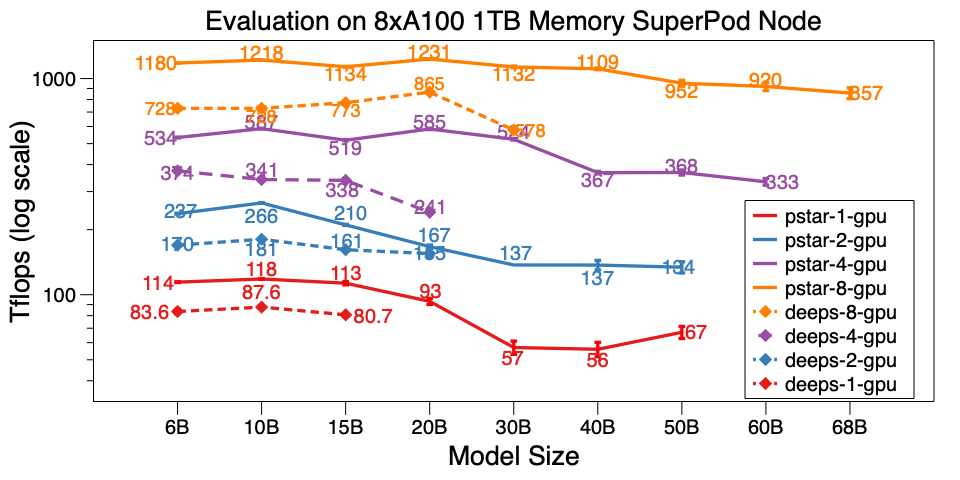

## PatrickStar: Parallel Training of Large Language Models via a Chunk-based Memory Management


### Recent Progress
See [CHANGE_LOG.md](./CHANGE_LOG.md).

### Meeting PatrickStar
Pre-Trained Models (PTM) are becoming the hotspot of both NLP research and industry application. However, the training of PTMs requires enormous hardware resources, which makes it only accessible to small portion of people in the AI community. Now, **PatrickStar will make PTM training available to everyone!**

Out of memory error (OOM) is the nightmare of every engineer training PTMs. To prevent such error, we often have to introduce more GPUs to store the model params. PatrickStar brings a better solution for such problem. With the **heterogeneous training** (DeepSpeed Zero Stage 3 also uses it), PatrickStar could make full use of both the CPU and GPU memory, so that you could use fewer GPUs to train larger models.

### System Design
The idea of Patrick is like this. The non-model data (mainly activations) varies during training, but the current heterogenous training solutions are **statically** spliting the model data to CPU and GPU. To make better use of the GPU, PatrickStar proposes a **dynamic** memory scheduling with the help of a chunk-based memory management module. The memory management of PatrickStar supports offloading everything but the current computing part of the model to CPU to save GPU. In addition, chunk-based memory management is efficient for collective communication when scaling to multiple GPU.
See the paper and [this doc](./INSIDE.md) for the idea behind PatrickStar.

### Results
In experiment, Patrickstar v0.4.3 is able to train a **18 Billion**(18B) param model with 8xTesla V100 GPU and 240GB GPU memory in WeChat datacenter node, whose network topology is like [this](./doc/yard_network_fabric.md). PatrickStar is over twice as large as the DeepSpeed. And the performance of PatrickStar is better for models of the same size as well. The pstar is PatrickStar v0.4.3. The deeps indicates performance of DeepSpeed v0.4.3 using the official example [DeepSpeed example](https://github.com/microsoft/DeepSpeedExamples/blob/master/Megatron-LM-v1.1.5-ZeRO3/examples/ds_pretrain_gpt2-zero3.sh) zero3 stage with activation optimzations openning by default.


We also evaluated PatrickStar v0.4.3 on a single node of A100 SuperPod. It is able to train 68B model on 8xA100 with 1TB CPU memory, which is over 6x larger than DeepSpeed v0.5.7. Besides the model scale, PatrickStar is way more efficient than DeepSpeed.



Detail benchmark results on WeChat AI data center as well as NVIDIA SuperPod are posted on this [Google Doc](https://docs.google.com/spreadsheets/d/136CWc_jA_2zC4h1r-6dzD4PrOvp6aw6uCDchEyQv6sE/edit?usp=sharing).


Scale PatrickStar to multiple machine (node) on SuperPod.
We succeed to train a GPT3-175B on 32 GPU. As far as we known, it is the first work
to run GPT3 on such small GPU cluster.
Microsoft used 10,000 V100 to pertrain GPT3.
Now you can finetune it or even pretrain your own one on 32 A100 GPU, amazing!


We've also trained the [CLUE-GPT2](https://huggingface.co/uer/gpt2-chinese-cluecorpussmall) model with PatrickStar, the loss and accuracy curve is shown below:


### Installation
```bash
pip install .
```

Note that PatrickStar requires gcc of version 7 or higher. You could also use NVIDIA NGC images, the following image is tested:

```bash
docker pull nvcr.io/nvidia/pytorch:21.06-py3
```

### Usage
PatrickStar is based on PyTorch, which makes it easy to migrate a pytorch project. Here is a example of PatrickStar:

```python
from patrickstar.runtime import initialize

config = {
    "optimizer": {
        "type": "Adam",
        "params": {
            "lr": 0.001,
            "betas": (0.9, 0.999),
            "eps": 1e-6,
            "weight_decay": 0,
        },
    },
    "chunk_size": 64 * 1024 * 1024,
    "release_after_init": True,
}

def model_func():
    # MyModel is a derived class for torch.nn.Module
    return MyModel(...)

model, optimizer = initialize(model_func=model_func, local_rank=0, config=config)

...

for data in dataloader:
    loss = model(data)
    model.backward(loss)
    model.step()
    model.zero_grad()
```

For some detail explanation of the above example, please check the guide [here](./GUIDE.md)

For more examples, please check [here](./examples).

A quick-start benchmark script is [here](./examples/run_transformers.sh). It is executed with random generated data, therefore you do not need to prepare the real data.


### Limitations

1. PatrickStar currently is not evaluated on DNN with parameters shared in different layers. For example, be careful to use it with tie-weight. But you can still label the tied weight to be managed by PyTorch, and make the remaining layers managed by PatrickStar chunk-based memory management.

### License
BSD 3-Clause License

### Cite Us
```
@article{fang2021patrickstar,
  title={PatrickStar: Parallel Training of Pre-trained Models via a Chunk-based Memory Management},
  author={Fang, Jiarui and Yu, Yang and Zhu, Zilin and Li, Shenggui and You, Yang and Zhou, Jie},
  journal={arXiv preprint arXiv:2108.05818},
  year={2021}
}
```

### Contact Us
{jiaruifang, zilinzhu, josephyu}@tencent.com

Powered by WeChat AI Team, Tencent NLP Oteam.
